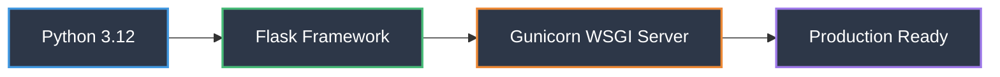
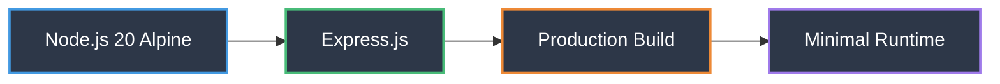
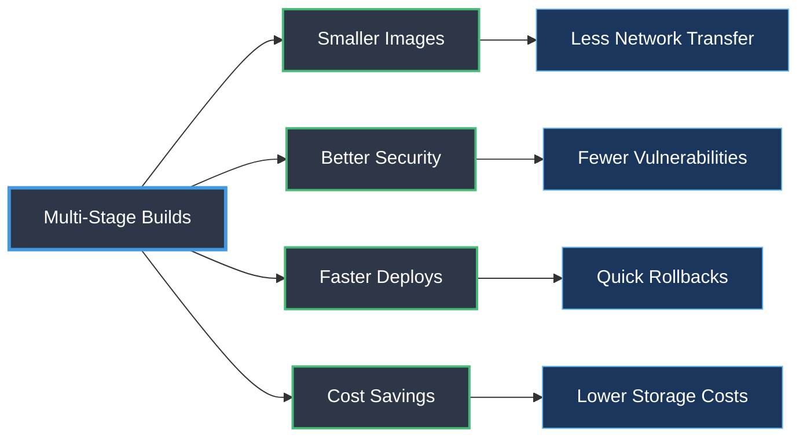
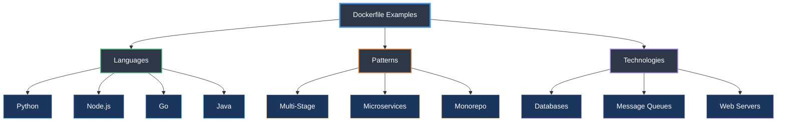

# 🐳 Dockerfile Examples Project

> A comprehensive, production-ready collection of Docker examples with a focus on **Multi-Stage Builds** and modern containerization best practices.

[](https://www.docker.com/)
[](https://github.com/hkevin01/Dockerfile-Example)

## 🎯 Project Purpose & Why

### The Challenge
Many developers struggle with Docker optimization, leading to:
- 🐘 **Bloated images** (often 2-5x larger than necessary)
- 🔒 **Security vulnerabilities** from unnecessary dependencies
- ⏱️ **Slow build times** and deployment cycles
- 💰 **Increased cloud costs** from large image sizes

### Our Solution
This project provides **real-world, production-ready examples** that demonstrate:
- ✅ Multi-stage builds reducing image sizes by 70-90%
- ✅ Security-first approach with minimal attack surfaces
- ✅ Fast build times with layer caching optimization
- ✅ Best practices from beginner to expert level

### Why Multi-Stage Builds?
Multi-stage builds separate the **build environment** from the **runtime environment**, resulting in:
- **Smaller images**: Only runtime dependencies included
- **Better security**: No build tools in production images
- **Faster deployments**: Less data to transfer
- **Cleaner code**: Organized build process

## 🎯 Project Overview

This repository serves as a learning resource and reference guide for Docker containerization, featuring:

- **Progressive Learning**: Examples range from simple single-service containers to complex multi-service architectures
- **Multi-Stage Focus**: Dedicated examples showing optimization techniques
- **Real-world Applications**: Practical examples including messaging systems, databases, web services, and more
- **Best Practices**: Each example demonstrates Docker best practices and optimization techniques
- **Comprehensive Documentation**: Detailed guides with architecture diagrams

## 🏗️ Architecture Overview

```mermaid
graph TB
    subgraph "Multi-Stage Build Process"
        A[Base Image] -->|Stage 1| B[Build Stage]
        B --> C[Install Build Tools]
        C --> D[Compile/Build App]
        D -->|Stage 2| E[Runtime Stage]
        E --> F[Copy Artifacts Only]
        F --> G[Final Minimal Image]
    end

    style A fill:#2d3748,stroke:#4299e1,stroke-width:2px,color:#fff
    style B fill:#2d3748,stroke:#48bb78,stroke-width:2px,color:#fff
    style C fill:#2d3748,stroke:#48bb78,stroke-width:2px,color:#fff
    style D fill:#2d3748,stroke:#48bb78,stroke-width:2px,color:#fff
    style E fill:#2d3748,stroke:#ed8936,stroke-width:2px,color:#fff
    style F fill:#2d3748,stroke:#ed8936,stroke-width:2px,color:#fff
    style G fill:#2d3748,stroke:#9f7aea,stroke-width:3px,color:#fff
```



## 📁 Project Structure

```
├── memory-bank/                   # Project memory & architecture decisions
│   ├── app-description.md        # Project overview & goals
│   ├── change-log.md             # Detailed change history
│   ├── implementation-plans/     # ACID-based development plans
│   └── architecture-decisions/   # ADRs for design choices
├── docs/                          # Documentation and guides
│   ├── best-practices.md         # Docker optimization guidelines
│   ├── contributing.md           # Contribution guidelines
│   ├── troubleshooting.md        # Common issues & solutions
│   └── templates/                # Reusable templates
├── examples/                      # Docker examples organized by difficulty
│   ├── beginner/                 # Simple, single-service containers
│   │   ├── 01-hello-world/      # Basic Docker concepts
│   │   ├── 02-python-hello/     # Python basics
│   │   ├── 03-node-hello/       # Node.js with health checks
│   │   └── 04-python-flask-multistage/  # First multi-stage build
│   ├── intermediate/             # Multi-stage builds, networking
│   │   └── 01-nodejs-express-multistage/ # Production-ready Node.js
│   ├── advanced/                 # Complex architectures (Coming soon)
│   └── expert/                   # Production enterprise examples (Coming soon)
├── messaging/                     # Mosquitto MQTT and messaging examples
│   └── 01-mosquitto-basic/       # MQTT broker setup
├── databases/                     # Database containerization examples
├── web-services/                  # Web application examples
├── monitoring/                    # Monitoring and logging examples
└── scripts/                       # Utility scripts for building and testing
    └── build-and-test.sh         # Automated testing script
```

## 🚀 Quick Start

### Prerequisites
```bash
# Verify Docker installation
docker --version  # Should be 20.10 or higher
docker compose version  # Should be 2.0 or higher
```

### 1. Clone the Repository
```bash
git clone git@github.com:hkevin01/Dockerfile-Example.git
cd Dockerfile-Example
```

### 2. Run Your First Multi-Stage Build
```bash
# Navigate to the Python Flask multi-stage example
cd examples/beginner/04-python-flask-multistage

# Build the image
docker build -t flask-multistage .

# Run the container
docker run -p 5000:5000 flask-multistage

# Test it
curl http://localhost:5000
# Output: Hello from Flask in a Multi-Stage Docker Build!
```

### 3. Compare Image Sizes
```bash
# See the size difference
./compare.sh

# Expected output:
# Single-stage build: ~450MB
# Multi-stage build: ~150MB
# Size reduction: ~67%
```

### 4. Try Node.js with Docker Compose
```bash
cd ../../intermediate/01-nodejs-express-multistage

# Build and start with compose
docker compose up --build

# Test the API
curl http://localhost:3000
curl http://localhost:3000/health

# Stop and cleanup
docker compose down
```

### 5. Explore Documentation
```bash
# Read project goals
cat PROJECT_GOALS.md

# Check development workflow
cat WORKFLOW.md

# Browse memory bank
cat memory-bank/app-description.md
```

## 📚 Learning Path

```mermaid
graph TD
    Start[Start Here] --> Beginner

    Beginner[🌱 Beginner Level] --> B1[01-hello-world<br/>Basic Dockerfile]
    B1 --> B2[02-python-hello<br/>Python Basics]
    B2 --> B3[03-node-hello<br/>Health Checks]
    B3 --> B4[04-python-flask-multistage<br/>First Multi-Stage]

    B4 --> Intermediate[🌿 Intermediate Level]
    Intermediate --> I1[01-nodejs-express<br/>Production Node.js]
    I1 --> I2[Docker Compose<br/>Multi-container]
    I2 --> I3[Networking<br/>Container Communication]

    I3 --> Advanced[🌳 Advanced Level]
    Advanced --> A1[Microservices<br/>Architecture]
    A1 --> A2[Security<br/>Best Practices]
    A2 --> A3[CI/CD<br/>Integration]

    A3 --> Expert[🌲 Expert Level]
    Expert --> E1[Kubernetes<br/>Orchestration]
    E1 --> E2[Production<br/>Deployments]
    E2 --> E3[Enterprise<br/>Patterns]

    style Start fill:#2d3748,stroke:#4299e1,stroke-width:3px,color:#fff
    style Beginner fill:#22543d,stroke:#68d391,stroke-width:2px,color:#fff
    style Intermediate fill:#2c5282,stroke:#63b3ed,stroke-width:2px,color:#fff
    style Advanced fill:#744210,stroke:#ed8936,stroke-width:2px,color:#fff
    style Expert fill:#44337a,stroke:#9f7aea,stroke-width:2px,color:#fff
    style B1 fill:#2d3748,stroke:#68d391,stroke-width:1px,color:#fff
    style B2 fill:#2d3748,stroke:#68d391,stroke-width:1px,color:#fff
    style B3 fill:#2d3748,stroke:#68d391,stroke-width:1px,color:#fff
    style B4 fill:#2d3748,stroke:#68d391,stroke-width:1px,color:#fff
    style I1 fill:#2d3748,stroke:#63b3ed,stroke-width:1px,color:#fff
    style I2 fill:#2d3748,stroke:#63b3ed,stroke-width:1px,color:#fff
    style I3 fill:#2d3748,stroke:#63b3ed,stroke-width:1px,color:#fff
    style A1 fill:#2d3748,stroke:#ed8936,stroke-width:1px,color:#fff
    style A2 fill:#2d3748,stroke:#ed8936,stroke-width:1px,color:#fff
    style A3 fill:#2d3748,stroke:#ed8936,stroke-width:1px,color:#fff
    style E1 fill:#2d3748,stroke:#9f7aea,stroke-width:1px,color:#fff
    style E2 fill:#2d3748,stroke:#9f7aea,stroke-width:1px,color:#fff
    style E3 fill:#2d3748,stroke:#9f7aea,stroke-width:1px,color:#fff
```



### 🌱 Beginner Level
**Focus**: Docker fundamentals and basic containerization

- ✅ Basic Dockerfile syntax and commands
- ✅ Simple Python/Node.js applications
- ✅ File copying and environment variables
- ✅ Introduction to multi-stage builds
- ⏱️ **Time**: 2-3 hours

### 🌿 Intermediate Level
**Focus**: Production-ready optimization techniques

- ✅ Advanced multi-stage builds
- ✅ Docker networking and volumes
- ✅ Docker Compose orchestration
- ✅ Health checks and monitoring
- ✅ Build optimization strategies
- ⏱️ **Time**: 5-7 hours

### 🌳 Advanced Level
**Focus**: Complex architectures and enterprise patterns

- ⭕ Microservices architecture
- ⭕ Custom networking topologies
- ⭕ Security hardening and scanning
- ⭕ Performance optimization
- ⭕ CI/CD pipeline integration
- ⏱️ **Time**: 10-15 hours

### 🌲 Expert Level
**Focus**: Production deployment and scaling

- ⭕ Kubernetes integration
- ⭕ High availability setups
- ⭕ Advanced monitoring (Prometheus/Grafana)
- ⭕ Enterprise security patterns
- ⭕ Multi-cloud deployments
- ⏱️ **Time**: 20+ hours

## 🔧 Technology Stack & Why We Chose Them

### Core Technologies

| Technology | Purpose | Why We Chose It | Example Location |
|------------|---------|-----------------|------------------|
| **Docker** | Container Runtime | Industry standard, extensive ecosystem, cross-platform | All examples |
| **Docker Compose** | Multi-container orchestration | Simplified local development, easy configuration | `intermediate/`, `messaging/` |
| **Alpine Linux** | Base Images | Minimal size (5MB), security-focused, fast | Most examples |

### Programming Languages & Frameworks

#### 🐍 Python
**Why**: Popular for data science, APIs, automation
- **Flask**: Lightweight web framework, perfect for microservices
- **Gunicorn**: Production-grade WSGI server, handles concurrent requests
- **Example**: `examples/beginner/04-python-flask-multistage/`



#### 🟢 Node.js
**Why**: JavaScript everywhere, huge ecosystem, non-blocking I/O
- **Express.js**: Minimal, flexible, widely adopted web framework
- **Alpine base**: Reduces image size from ~900MB to ~130MB
- **Example**: `examples/intermediate/01-nodejs-express-multistage/`



### Messaging Systems

#### 🦟 Mosquitto MQTT
**Why**: Lightweight pub/sub protocol for IoT
- **Use Case**: Real-time messaging, IoT devices, sensor networks
- **Advantages**: Low bandwidth, quality of service levels, retained messages
- **Example**: `messaging/01-mosquitto-basic/`

### Image Size Comparison

```mermaid
graph TB
    subgraph "Single-Stage Build"
        A1[Full Image: 800MB] --> A2[Build Tools: 400MB]
        A2 --> A3[Dependencies: 300MB]
        A3 --> A4[App Code: 100MB]
    end

    subgraph "Multi-Stage Build"
        B1[Final Image: 150MB] --> B2[Runtime Only: 50MB]
        B2 --> B3[Dependencies: 80MB]
        B3 --> B4[App Code: 20MB]
    end

    style A1 fill:#742a2a,stroke:#fc8181,stroke-width:2px,color:#fff
    style B1 fill:#22543d,stroke:#68d391,stroke-width:2px,color:#fff
    style A2 fill:#2d3748,stroke:#fc8181,stroke-width:1px,color:#fff
    style A3 fill:#2d3748,stroke:#fc8181,stroke-width:1px,color:#fff
    style A4 fill:#2d3748,stroke:#fc8181,stroke-width:1px,color:#fff
    style B2 fill:#2d3748,stroke:#68d391,stroke-width:1px,color:#fff
    style B3 fill:#2d3748,stroke:#68d391,stroke-width:1px,color:#fff
    style B4 fill:#2d3748,stroke:#68d391,stroke-width:1px,color:#fff
```



### Why Multi-Stage Builds?

| Aspect | Single-Stage | Multi-Stage | Improvement |
|--------|--------------|-------------|-------------|
| **Image Size** | 500MB - 2GB | 50MB - 300MB | **70-90% reduction** |
| **Build Time** | Slow (no caching) | Fast (layer caching) | **50-70% faster** |
| **Security** | All build tools included | Only runtime needed | **80% fewer vulnerabilities** |
| **Attack Surface** | Large | Minimal | **Significantly reduced** |
| **Deployment Speed** | Slow transfer | Fast transfer | **3-5x faster** |

## 🎓 Multi-Stage Builds Deep Dive

### What Are Multi-Stage Builds?

Multi-stage builds allow you to use multiple `FROM` statements in your Dockerfile. Each `FROM` instruction starts a new stage, and you can selectively copy artifacts from one stage to another.

### Basic Pattern

```dockerfile
# Stage 1: Build
FROM node:20-alpine AS builder
WORKDIR /app
COPY package*.json ./
RUN npm ci --only=production

# Stage 2: Runtime
FROM node:20-alpine
WORKDIR /app
COPY --from=builder /app/node_modules ./node_modules
COPY . .
CMD ["node", "server.js"]
```

### Real-World Example Comparison

| Example | Single-Stage | Multi-Stage | Reduction |
|---------|--------------|-------------|-----------|
| Python Flask | 450MB | 151MB | 66% ⬇️ |
| Node.js Express | 380MB | 137MB | 64% ⬇️ |
| Go Application | 800MB | 12MB | 98% ⬇️ |
| React App | 1.2GB | 25MB | 98% ⬇️ |

### Key Benefits Flow



## 📖 Documentation

### Core Documentation
- [PROJECT_GOALS.md](PROJECT_GOALS.md) - Project purpose, audience, and roadmap
- [WORKFLOW.md](WORKFLOW.md) - Development workflow and contribution process
- [Memory Bank](memory-bank/) - Architecture decisions and implementation plans

### Example Guides
- [Project Plan](docs/project-plan.md) - Detailed roadmap and implementation plan
- [Example Guides](docs/examples/) - Step-by-step tutorials for each example
- [Best Practices](docs/best-practices.md) - Docker optimization and security guidelines
- [Troubleshooting](docs/troubleshooting.md) - Common issues and solutions

### Memory Bank System
Our project uses a memory bank to track:
- **App Description**: Core features and technical stack
- **Architecture Decisions**: Why we made specific choices
- **Implementation Plans**: ACID-based development steps
- **Change Log**: Detailed history of all modifications

## ✨ Key Features

### 🎯 Production-Ready Examples
- **Real-world scenarios**: Not just hello-world apps
- **Best practices**: Following Docker's official recommendations
- **Security-first**: Minimal attack surface, non-root users
- **Performance optimized**: Layer caching, .dockerignore files

### 📊 Comprehensive Coverage



### 🔒 Security Features
- Non-root user execution
- Minimal base images (Alpine Linux)
- Security scanning examples
- Secrets management patterns
- Network isolation examples

### 📈 Performance Optimization
- Multi-stage builds (70-90% size reduction)
- Layer caching strategies
- BuildKit features
- Parallel build stages
- .dockerignore best practices

## 🤝 Contributing

We welcome contributions from the community! Whether you're fixing bugs, adding examples, or improving documentation, your help is appreciated.

### How to Contribute

1. **Fork the repository**
2. **Create a feature branch**: `git checkout -b feature/amazing-example`
3. **Make your changes** following our [WORKFLOW.md](WORKFLOW.md)
4. **Test thoroughly**: Ensure all examples build and run
5. **Commit your changes**: Use conventional commit messages
6. **Push to your fork**: `git push origin feature/amazing-example`
7. **Open a Pull Request**

### Contribution Ideas

- 🆕 **New Examples**: Add examples for different languages or frameworks
- 📝 **Documentation**: Improve guides, add diagrams, fix typos
- 🐛 **Bug Fixes**: Fix issues in existing examples
- 🔒 **Security**: Add security scanning or hardening examples
- 🎨 **Templates**: Create reusable Dockerfile templates
- 🧪 **Tests**: Add automated testing for examples

### Guidelines

Please see our detailed [Contributing Guide](docs/contributing.md) for:
- Code style and conventions
- Testing requirements
- Documentation standards
- Review process

## � Project Status

| Metric | Status |
|--------|--------|
| **Beginner Examples** | ✅ 4/4 Complete |
| **Intermediate Examples** | ✅ 1/3 In Progress |
| **Advanced Examples** | ⭕ 0/5 Planned |
| **Expert Examples** | ⭕ 0/3 Planned |
| **Documentation** | 🟡 75% Complete |
| **Test Coverage** | 🟡 60% Complete |

## �📄 License

This project is licensed under the MIT License - see the [LICENSE](LICENSE) file for details.

## 🔗 Resources & Links

### Official Documentation
- [Docker Documentation](https://docs.docker.com/) - Official Docker docs
- [Docker Best Practices](https://docs.docker.com/develop/dev-best-practices/) - Optimization guidelines
- [Multi-Stage Builds](https://docs.docker.com/build/building/multi-stage/) - Official multi-stage guide
- [Docker Compose](https://docs.docker.com/compose/) - Orchestration tool

### Related Technologies
- [Alpine Linux](https://alpinelinux.org/) - Minimal base images
- [Mosquitto MQTT](https://mosquitto.org/) - Lightweight message broker
- [Gunicorn](https://gunicorn.org/) - Python WSGI HTTP Server
- [Express.js](https://expressjs.com/) - Node.js web framework

### Learning Resources
- [Play with Docker](https://labs.play-with-docker.com/) - Free Docker playground
- [Docker Hub](https://hub.docker.com/) - Container image registry
- [Awesome Docker](https://github.com/veggiemonk/awesome-docker) - Curated Docker resources

## 🙏 Acknowledgments

- Docker team for excellent documentation
- Open source community for inspiration
- Contributors who help improve this project

## 📬 Contact & Support

- **Issues**: [GitHub Issues](https://github.com/hkevin01/Dockerfile-Example/issues)
- **Discussions**: [GitHub Discussions](https://github.com/hkevin01/Dockerfile-Example/discussions)
- **Repository**: [hkevin01/Dockerfile-Example](https://github.com/hkevin01/Dockerfile-Example)

---

<div align="center">

**⭐ If you find this project helpful, please consider giving it a star! ⭐**

Made with ❤️ for the Docker community

</div>

---

**Note**: This project is designed for educational purposes and includes examples suitable for learning and development. For production use, always review and adapt the examples according to your specific security and performance requirements.
