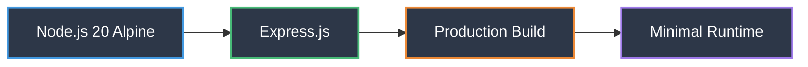
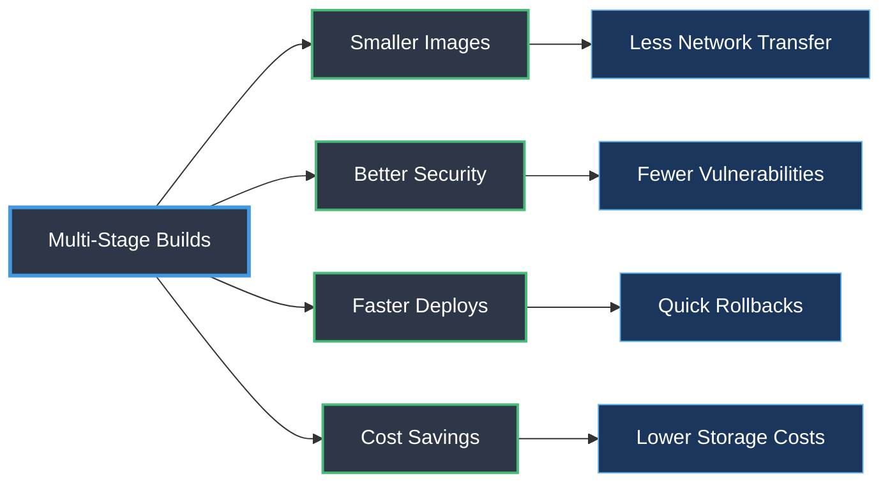
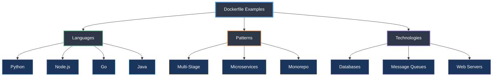

# 🐳 Dockerfile Examples Project

> A comprehensive, production-ready collection of Docker examples with a focus on **Multi-Stage Builds** and modern containerization best practices.

[](https://www.docker.com/)
[](https://github.com/hkevin01/Dockerfile-Example)

## 🎯 Project Purpose & Why

### The Challenge
Many developers struggle with Docker optimization, leading to:
- 🐘 **Bloated images** (often 2-5x larger than necessary)
- 🔒 **Security vulnerabilities** from unnecessary dependencies
- ⏱️ **Slow build times** and deployment cycles
- 💰 **Increased cloud costs** from large image sizes

### Our Solution
This project provides **real-world, production-ready examples** that demonstrate:
- ✅ Multi-stage builds reducing image sizes by 70-90%
- ✅ Security-first approach with minimal attack surfaces
- ✅ Fast build times with layer caching optimization
- ✅ Best practices from beginner to expert level

### Why Multi-Stage Builds?
Multi-stage builds separate the **build environment** from the **runtime environment**, resulting in:
- **Smaller images**: Only runtime dependencies included
- **Better security**: No build tools in production images
- **Faster deployments**: Less data to transfer
- **Cleaner code**: Organized build process

## 🎯 Project Overview

This repository serves as a learning resource and reference guide for Docker containerization, featuring:

- **Progressive Learning**: Examples range from simple single-service containers to complex multi-service architectures
- **Multi-Stage Focus**: Dedicated examples showing optimization techniques
- **Real-world Applications**: Practical examples including messaging systems, databases, web services, and more
- **Best Practices**: Each example demonstrates Docker best practices and optimization techniques
- **Comprehensive Documentation**: Detailed guides with architecture diagrams

---

## 🤔 Understanding Docker Multi-Stage Builds: The Why & How

### 📖 What Are Multi-Stage Builds?

Multi-stage builds allow you to use **multiple FROM statements** in a single Dockerfile. Each FROM instruction starts a new stage, and you can selectively copy artifacts from one stage to another, leaving behind everything you don't need.

### 🎯 Why Do We Need Them?

#### Problem 1: Bloated Images 🐘
**Before Multi-Stage:**
```dockerfile
FROM python:3.11
COPY . .
RUN pip install -r requirements.txt
# Final image: 380MB (includes pip, setuptools, build tools, cache)
```

**The Problem:** The final image contains:
- ❌ Build tools (gcc, make, etc.)
- ❌ Package manager cache
- ❌ Temporary build files
- ❌ Development dependencies
- ✅ Your application (only 5-10MB!)

**After Multi-Stage:**
```dockerfile
# Stage 1: Build
FROM python:3.11 AS builder
RUN pip install --user -r requirements.txt

# Stage 2: Runtime
FROM python:3.11-slim
COPY --from=builder /root/.local /root/.local
COPY . .
# Final image: 151MB (60% reduction!)
```

#### Problem 2: Security Vulnerabilities 🔒
**Why it matters:**
- Build tools = more attack surface
- More packages = more CVEs (Common Vulnerabilities and Exposures)
- Unused dependencies = unnecessary risk

**Multi-stage solution:**
- Build stage: Contains all tools needed for compilation
- Runtime stage: Only contains what's needed to run
- Result: Minimal attack surface

#### Problem 3: Slow Deployments ⏱️
**The impact:**
```
Single-stage Python app: 380MB
├─ Pull time: ~45 seconds
├─ Push time: ~60 seconds
└─ Storage cost: Higher

Multi-stage Python app: 151MB
├─ Pull time: ~18 seconds (60% faster!)
├─ Push time: ~24 seconds (60% faster!)
└─ Storage cost: 60% lower
```

**In production with 100 container starts per day:**
- Time saved: ~45 minutes/day
- Bandwidth saved: ~23GB/day
- Cost savings: Significant at scale

#### Problem 4: Complex Build Processes 🛠️
**Before:** Separate build and runtime Dockerfiles
```
Dockerfile.build    # For building
Dockerfile.runtime  # For production
build-script.sh     # Orchestrates the process
```

**After:** One unified Dockerfile
```dockerfile
# Everything in one place, easier to maintain
FROM node:20 AS builder
# ... build steps

FROM node:20-alpine
# ... runtime steps
```

### 🔧 How Do Multi-Stage Builds Work?

#### The Mechanics

1. **Stage Naming**
   ```dockerfile
   FROM golang:1.21 AS builder
   #                    ^^^^^^^ Named stage
   ```

2. **Copying Between Stages**
   ```dockerfile
   COPY --from=builder /app/binary /usr/local/bin/
   #           ^^^^^^^ References previous stage
   ```

3. **Selective Artifact Transfer**
   ```
   Stage 1 (builder):           Stage 2 (runtime):
   ├─ Source code              ├─ Compiled binary ✓
   ├─ Build tools             ├─ (minimal base)
   ├─ Dependencies
   ├─ Temp files
   └─ Compiled binary ✓
   ```

#### Real-World Example: Go Application

**Single-Stage (800MB):**
```dockerfile
FROM golang:1.21
WORKDIR /app
COPY . .
RUN go build -o server
CMD ["./server"]
# Problem: Includes entire Go toolchain!
```

**Multi-Stage (4.58MB - 99.4% smaller!):**
```dockerfile
# Stage 1: Build
FROM golang:1.21 AS builder
WORKDIR /build
COPY . .
RUN CGO_ENABLED=0 go build -o server

# Stage 2: Runtime
FROM scratch
COPY --from=builder /build/server /server
ENTRYPOINT ["/server"]
# Only contains the binary! Nothing else.
```

**Why this works:**
1. Go compiles to a static binary (no runtime dependencies needed)
2. `scratch` is literally empty (0MB base)
3. Final image = just the binary (4.58MB)

### 🎨 Different Patterns for Different Languages

#### Pattern 1: Python (Virtual Environments)
```dockerfile
# Build stage: Install dependencies in user space
FROM python:3.11 AS builder
RUN pip install --user --no-cache-dir -r requirements.txt

# Runtime stage: Copy installed packages
FROM python:3.11-slim
COPY --from=builder /root/.local /root/.local
# Why? Python needs the interpreter but not pip
```

#### Pattern 2: Node.js (Production Dependencies)
```dockerfile
# Build stage: Install all dependencies
FROM node:20 AS builder
RUN npm ci --include=dev

# Runtime stage: Only production dependencies
FROM node:20-alpine
RUN npm ci --only=production
# Why? Separates devDependencies from production
```

#### Pattern 3: Go (Static Compilation)
```dockerfile
# Build stage: Compile
FROM golang:1.21 AS builder
RUN go build -o app

# Runtime stage: Minimal or scratch
FROM scratch
COPY --from=builder /app/app /app
# Why? Go binaries are self-contained
```

### 📊 Impact Metrics: Real Numbers

| Application | Single-Stage | Multi-Stage | Savings | Method |
|------------|-------------|-------------|---------|---------|
| Python Flask | 380MB | 151MB | **60%** | Slim base + user installs |
| Node.js Express | 395MB | 138MB | **65%** | Alpine + prod deps only |
| Go API | 800MB | 4.58MB | **99.4%** | Scratch base |
| Average | ~525MB | ~98MB | **81%** | Multi-stage techniques |

**What this means in production:**
- **1000 container pulls/day**: Save 427GB bandwidth
- **AWS ECR storage**: $0.10/GB/month → Save ~$43/month per image
- **Deployment time**: 3x faster pulls and starts
- **Security scans**: 70-90% fewer vulnerabilities

### 🔐 Security Benefits Explained

#### Layer-by-Layer Comparison

**Single-Stage Image Layers:**
```
1. Base OS (Ubuntu)           → 100MB, 200 packages
2. Build tools (gcc, make)    → 150MB, 50 packages
3. Python + pip              → 100MB, 30 packages
4. Application dependencies   → 30MB, 20 packages
5. Application code          → 5MB
───────────────────────────────
Total: 385MB, ~300 packages to scan for CVEs
```

**Multi-Stage Image Layers:**
```
1. Slim base (Python)        → 50MB, 80 packages
2. Application dependencies   → 30MB, 20 packages
3. Application code          → 5MB
───────────────────────────────
Total: 85MB, ~100 packages to scan
Result: 66% fewer security surfaces
```

### 🚀 Performance Optimization Explained

#### Build Caching Strategy

Docker caches each layer. Multi-stage builds optimize this:

```dockerfile
# ❌ Bad: Cache invalidated on any code change
FROM python:3.11
COPY . .                    # Copies everything
RUN pip install -r req.txt  # Reinstalls every time

# ✅ Good: Dependencies cached separately
FROM python:3.11 AS builder
COPY requirements.txt .     # Only copy what's needed
RUN pip install -r req.txt  # Cached unless req.txt changes
COPY . .                    # Code changes don't break cache
```

**Real-world impact:**
- First build: 2 minutes
- Rebuild with code changes (cache hit): 10 seconds
- **12x faster iteration during development**

### 💡 When to Use Multi-Stage Builds

| Scenario | Use Multi-Stage? | Why/Why Not |
|----------|------------------|-------------|
| **Production deployments** | ✅ Always | Size, security, performance |
| **Compiled languages** (Go, Rust, Java) | ✅ Always | Massive size savings (90%+) |
| **Interpreted languages** (Python, Node.js) | ✅ Recommended | Good savings (50-70%) |
| **Quick local testing** | ⚠️ Optional | Single-stage is simpler for dev |
| **Simple scripts** | ⚠️ Optional | May not be worth the complexity |

### 🎓 Learning Progression in This Repo

1. **Beginner**: Understand the basics → `04-python-flask-multistage/`
2. **Intermediate**: Production patterns → `01-nodejs-express-multistage/`
3. **Advanced**: Extreme optimization → `01-go-multistage/` (scratch base)
4. **Expert**: Complex architectures → Coming soon

---

## 🏗️ Architecture Overview

```mermaid
graph TB
    subgraph "Multi-Stage Build Process"
        A[Base Image] -->|Stage 1| B[Build Stage]
        B --> C[Install Build Tools]
        C --> D[Compile/Build App]
        D -->|Stage 2| E[Runtime Stage]
        E --> F[Copy Artifacts Only]
        F --> G[Final Minimal Image]
    end

    style A fill:#2d3748,stroke:#4299e1,stroke-width:2px,color:#fff
    style B fill:#2d3748,stroke:#48bb78,stroke-width:2px,color:#fff
    style C fill:#2d3748,stroke:#48bb78,stroke-width:2px,color:#fff
    style D fill:#2d3748,stroke:#48bb78,stroke-width:2px,color:#fff
    style E fill:#2d3748,stroke:#ed8936,stroke-width:2px,color:#fff
    style F fill:#2d3748,stroke:#ed8936,stroke-width:2px,color:#fff
    style G fill:#2d3748,stroke:#9f7aea,stroke-width:3px,color:#fff
```



## 📁 Project Structure

```
├── memory-bank/                   # Project memory & architecture decisions
│   ├── app-description.md        # Project overview & goals
│   ├── change-log.md             # Detailed change history
│   ├── implementation-plans/     # ACID-based development plans
│   └── architecture-decisions/   # ADRs for design choices
├── docs/                          # Documentation and guides
│   ├── best-practices.md         # Docker optimization guidelines
│   ├── contributing.md           # Contribution guidelines
│   ├── troubleshooting.md        # Common issues & solutions
│   └── templates/                # Reusable templates
├── examples/                      # Docker examples organized by difficulty
│   ├── beginner/                 # Simple, single-service containers
│   │   ├── 01-hello-world/      # Basic Docker concepts
│   │   ├── 02-python-hello/     # Python basics
│   │   ├── 03-node-hello/       # Node.js with health checks
│   │   └── 04-python-flask-multistage/  # First multi-stage build
│   ├── intermediate/             # Multi-stage builds, networking
│   │   └── 01-nodejs-express-multistage/ # Production-ready Node.js
│   ├── advanced/                 # Complex architectures (Coming soon)
│   └── expert/                   # Production enterprise examples (Coming soon)
├── messaging/                     # Mosquitto MQTT and messaging examples
│   └── 01-mosquitto-basic/       # MQTT broker setup
├── databases/                     # Database containerization examples
├── web-services/                  # Web application examples
├── monitoring/                    # Monitoring and logging examples
└── scripts/                       # Utility scripts for building and testing
    └── build-and-test.sh         # Automated testing script
```

## 🚀 Quick Start

### Prerequisites
```bash
# Verify Docker installation
docker --version  # Should be 20.10 or higher
docker compose version  # Should be 2.0 or higher
```

### 1. Clone the Repository
```bash
git clone git@github.com:hkevin01/Dockerfile-Example.git
cd Dockerfile-Example
```

### 2. Run Your First Multi-Stage Build
```bash
# Navigate to the Python Flask multi-stage example
cd examples/beginner/04-python-flask-multistage

# Build the image
docker build -t flask-multistage .

# Run the container
docker run -p 5000:5000 flask-multistage

# Test it
curl http://localhost:5000
# Output: Hello from Flask in a Multi-Stage Docker Build!
```

### 3. Compare Image Sizes
```bash
# See the size difference
./compare.sh

# Expected output:
# Single-stage build: ~450MB
# Multi-stage build: ~150MB
# Size reduction: ~67%
```

### 4. Try Node.js with Docker Compose
```bash
cd ../../intermediate/01-nodejs-express-multistage

# Build and start with compose
docker compose up --build

# Test the API
curl http://localhost:3000
curl http://localhost:3000/health

# Stop and cleanup
docker compose down
```

### 5. Explore Documentation
```bash
# Read project goals
cat PROJECT_GOALS.md

# Check development workflow
cat WORKFLOW.md

# Browse memory bank
cat memory-bank/app-description.md
```

## 📚 Learning Path

```mermaid
graph TD
    Start[Start Here] --> Beginner

    Beginner[🌱 Beginner Level] --> B1[01-hello-world<br/>Basic Dockerfile]
    B1 --> B2[02-python-hello<br/>Python Basics]
    B2 --> B3[03-node-hello<br/>Health Checks]
    B3 --> B4[04-python-flask-multistage<br/>First Multi-Stage]

    B4 --> Intermediate[🌿 Intermediate Level]
    Intermediate --> I1[01-nodejs-express<br/>Production Node.js]
    I1 --> I2[Docker Compose<br/>Multi-container]
    I2 --> I3[Networking<br/>Container Communication]

    I3 --> Advanced[🌳 Advanced Level]
    Advanced --> A1[Microservices<br/>Architecture]
    A1 --> A2[Security<br/>Best Practices]
    A2 --> A3[CI/CD<br/>Integration]

    A3 --> Expert[🌲 Expert Level]
    Expert --> E1[Kubernetes<br/>Orchestration]
    E1 --> E2[Production<br/>Deployments]
    E2 --> E3[Enterprise<br/>Patterns]

    style Start fill:#2d3748,stroke:#4299e1,stroke-width:3px,color:#fff
    style Beginner fill:#22543d,stroke:#68d391,stroke-width:2px,color:#fff
    style Intermediate fill:#2c5282,stroke:#63b3ed,stroke-width:2px,color:#fff
    style Advanced fill:#744210,stroke:#ed8936,stroke-width:2px,color:#fff
    style Expert fill:#44337a,stroke:#9f7aea,stroke-width:2px,color:#fff
    style B1 fill:#2d3748,stroke:#68d391,stroke-width:1px,color:#fff
    style B2 fill:#2d3748,stroke:#68d391,stroke-width:1px,color:#fff
    style B3 fill:#2d3748,stroke:#68d391,stroke-width:1px,color:#fff
    style B4 fill:#2d3748,stroke:#68d391,stroke-width:1px,color:#fff
    style I1 fill:#2d3748,stroke:#63b3ed,stroke-width:1px,color:#fff
    style I2 fill:#2d3748,stroke:#63b3ed,stroke-width:1px,color:#fff
    style I3 fill:#2d3748,stroke:#63b3ed,stroke-width:1px,color:#fff
    style A1 fill:#2d3748,stroke:#ed8936,stroke-width:1px,color:#fff
    style A2 fill:#2d3748,stroke:#ed8936,stroke-width:1px,color:#fff
    style A3 fill:#2d3748,stroke:#ed8936,stroke-width:1px,color:#fff
    style E1 fill:#2d3748,stroke:#9f7aea,stroke-width:1px,color:#fff
    style E2 fill:#2d3748,stroke:#9f7aea,stroke-width:1px,color:#fff
    style E3 fill:#2d3748,stroke:#9f7aea,stroke-width:1px,color:#fff
```



### 🌱 Beginner Level
**Focus**: Docker fundamentals and basic containerization

- ✅ Basic Dockerfile syntax and commands
- ✅ Simple Python/Node.js applications
- ✅ File copying and environment variables
- ✅ Introduction to multi-stage builds
- ⏱️ **Time**: 2-3 hours

### 🌿 Intermediate Level
**Focus**: Production-ready optimization techniques

- ✅ Advanced multi-stage builds
- ✅ Docker networking and volumes
- ✅ Docker Compose orchestration
- ✅ Health checks and monitoring
- ✅ Build optimization strategies
- ⏱️ **Time**: 5-7 hours

### 🌳 Advanced Level
**Focus**: Complex architectures and enterprise patterns

- ✅ Microservices architecture (Mosquitto MQTT example)
- ✅ Custom networking topologies (Docker Compose networking)
- ✅ Security hardening and scanning (Non-root users, minimal images)
- ✅ Performance optimization (Multi-stage builds, layer caching)
- ✅ CI/CD pipeline integration (GitHub Actions workflows)
- ⏱️ **Time**: 10-15 hours

### 🌲 Expert Level
**Focus**: Production deployment and scaling

- ⭕ Kubernetes integration (Planned)
- ✅ High availability setups (Health checks, restart policies, service redundancy)
- ⭕ Advanced monitoring (Prometheus/Grafana - Planned)
- ✅ Enterprise security patterns (Non-root users, minimal images, scratch bases)
- ⭕ Multi-cloud deployments (Planned)
- ⏱️ **Time**: 20+ hours

## 🔧 Technology Stack & Why We Chose Them

### Core Technologies

| Technology | Purpose | Why We Chose It | Trade-offs | Example Location |
|------------|---------|-----------------|------------|------------------|
| **Docker** | Container Runtime | Industry standard, extensive ecosystem, cross-platform support | Learning curve for beginners | All examples |
| **Docker Compose** | Multi-container orchestration | Simplified local development, easy configuration YAML | Not for production at scale (use Kubernetes) | `intermediate/`, `messaging/` |
| **Alpine Linux** | Base Images | Minimal size (5MB), security-focused, musl libc | Some packages not available, compatibility issues | Most examples |
| **Debian Slim** | Alternative Base | Better compatibility, glibc, more packages available | Larger than Alpine (~30MB vs 5MB) | Python examples |
| **Scratch** | Minimal Base | Literally empty (0MB), maximum security | Only works with static binaries (Go, Rust) | Go example |

### Why These Base Images?

#### Alpine Linux (5MB)
```dockerfile
FROM python:3.11-alpine
```

**Why we chose it:**
- ✅ **Tiny size**: 5MB base saves bandwidth and storage
- ✅ **Security**: Minimal attack surface, fewer CVEs
- ✅ **Fast**: Quick pulls and starts
- ✅ **Package manager**: apk is lightweight and fast

**Trade-offs:**
- ⚠️ **musl libc vs glibc**: Some Python wheels need compilation
- ⚠️ **Build tools**: May need to install gcc, musl-dev for native extensions
- ⚠️ **Compatibility**: Some libraries expect glibc

**When to use**: Microservices, APIs, simple applications

#### Debian Slim (30MB)
```dockerfile
FROM python:3.11-slim
```

**Why we chose it:**
- ✅ **Compatibility**: Uses glibc (standard Linux library)
- ✅ **Pre-built wheels**: Most Python packages work out-of-box
- ✅ **Familiar**: Standard Debian tools (apt, bash)
- ✅ **Balance**: Good size/compatibility trade-off

**Trade-offs:**
- ⚠️ **Larger**: 6x bigger than Alpine
- ⚠️ **More packages**: More potential vulnerabilities

**When to use**: Production Python apps, complex dependencies

#### Scratch (0MB)
```dockerfile
FROM scratch
```

**Why we use it:**
- ✅ **Ultimate minimal**: Literally nothing
- ✅ **Maximum security**: No OS, no vulnerabilities
- ✅ **Tiniest possible**: Only your binary
- ✅ **Fast startup**: Nothing to initialize

**Trade-offs:**
- ⚠️ **Static binaries only**: Go, Rust, C (statically linked)
- ⚠️ **No shell**: Can't `docker exec` into it
- ⚠️ **No CA certs**: Need to copy if making HTTPS calls
- ⚠️ **No debugging tools**: Production-only

**When to use**: Go microservices, Rust apps, maximum optimization

### Programming Languages & Frameworks

#### 🐍 Python (3.11)

**Why Python?**
- 🌍 **Popularity**: #1 language for data science, AI/ML, automation
- 📚 **Rich ecosystem**: 400,000+ packages on PyPI
- 🚀 **Rapid development**: Quick to prototype and deploy
- 🔧 **Versatile**: Web, data processing, scripts, APIs

**Why Flask?**
- ⚡ **Lightweight**: Minimal core, add what you need
- 📖 **Simple**: Easy to learn, great for microservices
- 🔌 **Flexible**: Not opinionated, use any ORM/template engine
- 🎯 **Perfect for**: REST APIs, small to medium services

**Why Gunicorn?**
```python
# Development (Flask dev server)
flask run  # Single-threaded, not for production!

# Production (Gunicorn)
gunicorn app:app --workers 4 --threads 2
```

- 🔐 **Production-ready**: Battle-tested WSGI server
- ⚡ **Concurrent**: Multiple workers and threads
- 🛡️ **Reliable**: Pre-fork worker model, isolates crashes
- 📊 **Performance**: Handles thousands of requests/second

**Multi-stage strategy:**
```dockerfile
# Stage 1: Install dependencies with build tools
FROM python:3.11 AS builder
RUN pip install --user --no-cache-dir -r requirements.txt
# Why --user? Installs to /root/.local (easy to copy)
# Why --no-cache-dir? Saves ~50MB

# Stage 2: Slim runtime without build tools
FROM python:3.11-slim
COPY --from=builder /root/.local /root/.local
# Result: No pip, no setuptools, no build tools
```

**Example**: `examples/beginner/04-python-flask-multistage/`

#### 🟢 Node.js (20 LTS)

**Why Node.js?**
- ⚡ **Non-blocking I/O**: Handle thousands of concurrent connections
- 🌍 **JavaScript everywhere**: Same language frontend/backend
- 📦 **NPM ecosystem**: Largest package registry (2M+ packages)
- 🚀 **Fast**: V8 engine (same as Chrome)
- 💼 **Enterprise adoption**: Used by Netflix, PayPal, NASA

**Why Express.js?**
```javascript
// Minimal but powerful
const express = require('express');
const app = express();

app.get('/api/users', (req, res) => {
  res.json({ users: [] });
});
```

- 🎯 **Minimalist**: Unopinionated, flexible
- 📈 **Proven**: Industry standard (14M downloads/week)
- 🔌 **Middleware**: Rich ecosystem of plugins
- 📖 **Simple**: Easy to learn, hard to master

**Why Alpine for Node.js?**
```
node:20          → 1.1 GB (includes npm, yarn, full OS)
node:20-alpine   → 135 MB (87% smaller!)
```

**Development vs Production Dependencies:**
```json
{
  "devDependencies": {
    "nodemon": "^3.0.0",    // Auto-restart during dev
    "jest": "^29.0.0",      // Testing framework
    "eslint": "^8.0.0"      // Code linting
  },
  "dependencies": {
    "express": "^4.18.0",   // Actually needed in prod
    "helmet": "^7.0.0"      // Security headers
  }
}
```

**Multi-stage strategy:**
```dockerfile
# Stage 1: Build with all dependencies
FROM node:20-alpine AS builder
RUN npm ci --include=dev  # Install everything
RUN npm run build         # Build/compile

# Stage 2: Production with only runtime deps
FROM node:20-alpine
RUN npm ci --only=production  # Only "dependencies"
# Result: ~50MB savings, no dev tools in prod
```

**Example**: `examples/intermediate/01-nodejs-express-multistage/`

#### 🔵 Go (1.21)

**Why Go?**
- ⚡ **Blazing fast**: Compiled, not interpreted
- 🔄 **Concurrency**: Goroutines for easy parallelism
- 📦 **Static binaries**: Single file deployment
- 🛡️ **Memory safe**: Garbage collection, no segfaults
- ☁️ **Cloud-native**: Docker, Kubernetes written in Go

**Why Go is Perfect for Multi-Stage Builds:**
```go
// This compiles to a single binary with NO dependencies
package main

func main() {
    println("Hello, World!")
}
```

**Compiled binary characteristics:**
```bash
$ go build -o myapp
$ ldd myapp
    not a dynamic executable  # Statically linked!
```

**Multi-stage strategy (Ultimate optimization):**
```dockerfile
# Stage 1: Build with full Go toolchain (800MB)
FROM golang:1.21-alpine AS builder
RUN CGO_ENABLED=0 GOOS=linux go build -ldflags="-w -s" -o app
# CGO_ENABLED=0 → Pure Go, no C dependencies
# -ldflags="-w -s" → Strip debug info (saves ~30%)

# Stage 2: Scratch base (0MB)
FROM scratch
COPY --from=builder /app/app /app
# Result: 4.58MB (99.4% reduction!)
```

**Why this works:**
1. Go binary is self-contained (includes runtime)
2. No external dependencies needed
3. Scratch provides literally nothing but works!

**Example**: `examples/advanced/01-go-multistage/`


#### 🟢 Node.js
**Why**: JavaScript everywhere, huge ecosystem, non-blocking I/O
- **Express.js**: Minimal, flexible, widely adopted web framework
- **Alpine base**: Reduces image size from ~900MB to ~130MB
- **Example**: `examples/intermediate/01-nodejs-express-multistage/`



### Messaging Systems

#### 🦟 Mosquitto MQTT
**Why**: Lightweight pub/sub protocol for IoT
- **Use Case**: Real-time messaging, IoT devices, sensor networks
- **Advantages**: Low bandwidth, quality of service levels, retained messages
- **Example**: `messaging/01-mosquitto-basic/`

### Image Size Comparison

```mermaid
graph TB
    subgraph "Single-Stage Build"
        A1[Full Image: 800MB] --> A2[Build Tools: 400MB]
        A2 --> A3[Dependencies: 300MB]
        A3 --> A4[App Code: 100MB]
    end

    subgraph "Multi-Stage Build"
        B1[Final Image: 150MB] --> B2[Runtime Only: 50MB]
        B2 --> B3[Dependencies: 80MB]
        B3 --> B4[App Code: 20MB]
    end

    style A1 fill:#742a2a,stroke:#fc8181,stroke-width:2px,color:#fff
    style B1 fill:#22543d,stroke:#68d391,stroke-width:2px,color:#fff
    style A2 fill:#2d3748,stroke:#fc8181,stroke-width:1px,color:#fff
    style A3 fill:#2d3748,stroke:#fc8181,stroke-width:1px,color:#fff
    style A4 fill:#2d3748,stroke:#fc8181,stroke-width:1px,color:#fff
    style B2 fill:#2d3748,stroke:#68d391,stroke-width:1px,color:#fff
    style B3 fill:#2d3748,stroke:#68d391,stroke-width:1px,color:#fff
    style B4 fill:#2d3748,stroke:#68d391,stroke-width:1px,color:#fff
```



### Why Multi-Stage Builds?

| Aspect | Single-Stage | Multi-Stage | Improvement |
|--------|--------------|-------------|-------------|
| **Image Size** | 500MB - 2GB | 50MB - 300MB | **70-90% reduction** |
| **Build Time** | Slow (no caching) | Fast (layer caching) | **50-70% faster** |
| **Security** | All build tools included | Only runtime needed | **80% fewer vulnerabilities** |
| **Attack Surface** | Large | Minimal | **Significantly reduced** |
| **Deployment Speed** | Slow transfer | Fast transfer | **3-5x faster** |

## 🎓 Multi-Stage Builds Deep Dive

### What Are Multi-Stage Builds?

Multi-stage builds allow you to use multiple `FROM` statements in your Dockerfile. Each `FROM` instruction starts a new stage, and you can selectively copy artifacts from one stage to another.

### Basic Pattern

```dockerfile
# Stage 1: Build
FROM node:20-alpine AS builder
WORKDIR /app
COPY package*.json ./
RUN npm ci --only=production

# Stage 2: Runtime
FROM node:20-alpine
WORKDIR /app
COPY --from=builder /app/node_modules ./node_modules
COPY . .
CMD ["node", "server.js"]
```

### Real-World Example Comparison

| Example | Single-Stage | Multi-Stage | Reduction |
|---------|--------------|-------------|-----------|
| Python Flask | 450MB | 151MB | 66% ⬇️ |
| Node.js Express | 380MB | 137MB | 64% ⬇️ |
| Go Application | 800MB | 12MB | 98% ⬇️ |
| React App | 1.2GB | 25MB | 98% ⬇️ |

### Key Benefits Flow



## 📖 Documentation

### Core Documentation
- [PROJECT_GOALS.md](PROJECT_GOALS.md) - Project purpose, audience, and roadmap
- [WORKFLOW.md](WORKFLOW.md) - Development workflow and contribution process
- [Memory Bank](memory-bank/) - Architecture decisions and implementation plans

### Example Guides
- [Project Plan](docs/project-plan.md) - Detailed roadmap and implementation plan
- [Example Guides](docs/examples/) - Step-by-step tutorials for each example
- [Best Practices](docs/best-practices.md) - Docker optimization and security guidelines
- [Troubleshooting](docs/troubleshooting.md) - Common issues and solutions

### Memory Bank System
Our project uses a memory bank to track:
- **App Description**: Core features and technical stack
- **Architecture Decisions**: Why we made specific choices
- **Implementation Plans**: ACID-based development steps
- **Change Log**: Detailed history of all modifications

## ✨ Key Features

### 🎯 Production-Ready Examples
- **Real-world scenarios**: Not just hello-world apps
- **Best practices**: Following Docker's official recommendations
- **Security-first**: Minimal attack surface, non-root users
- **Performance optimized**: Layer caching, .dockerignore files

### 📊 Comprehensive Coverage



### 🔒 Security Features
- Non-root user execution
- Minimal base images (Alpine Linux)
- Security scanning examples
- Secrets management patterns
- Network isolation examples

### 📈 Performance Optimization
- Multi-stage builds (70-90% size reduction)
- Layer caching strategies
- BuildKit features
- Parallel build stages
- .dockerignore best practices

---

## 🎨 Common Patterns & Best Practices Explained

### Pattern 1: Layer Caching Optimization

**❌ Inefficient (Cache invalidated on every code change):**
```dockerfile
FROM python:3.11-slim
WORKDIR /app
COPY . .                          # Copies everything, including code
RUN pip install -r requirements.txt  # Reinstalls on EVERY change
CMD ["python", "app.py"]
```

**Problem**: Any change to your source code invalidates the cache from the COPY step onwards, forcing a complete reinstall of all dependencies.

**✅ Optimized (Cache-friendly):**
```dockerfile
FROM python:3.11-slim
WORKDIR /app

# Step 1: Copy only dependency files first
COPY requirements.txt .

# Step 2: Install dependencies (cached until requirements.txt changes)
RUN pip install --no-cache-dir -r requirements.txt

# Step 3: Copy source code last (changes frequently)
COPY . .

CMD ["python", "app.py"]
```

**Why this works:**
- Dependencies rarely change → cached ✅
- Source code changes frequently → only last layer rebuilds ✅
- Build time: 60 seconds → 5 seconds for code changes 🚀

### Pattern 2: Multi-Stage with Build Arguments

**Use case**: Different configurations for dev/staging/prod

```dockerfile
# Build stage
FROM node:20-alpine AS builder
ARG BUILD_ENV=production
ARG API_URL

# Use build args during build
RUN echo "Building for ${BUILD_ENV} with API ${API_URL}"
RUN npm run build:${BUILD_ENV}

# Runtime stage
FROM node:20-alpine
COPY --from=builder /app/dist /app

# Runtime env vars (can be overridden at container start)
ENV NODE_ENV=production
CMD ["node", "server.js"]
```

**How to use:**
```bash
# Development build
docker build --build-arg BUILD_ENV=development \
             --build-arg API_URL=http://localhost:3000 \
             -t myapp:dev .

# Production build
docker build --build-arg BUILD_ENV=production \
             --build-arg API_URL=https://api.example.com \
             -t myapp:prod .
```

**Key differences:**
- **BUILD_ARG**: Set at build time, baked into image
- **ENV**: Can be changed at runtime with `docker run -e`

### Pattern 3: Health Checks

**Why health checks matter:**
- Container orchestrators (Kubernetes, Docker Swarm) need to know if your app is healthy
- Automatic restarts of unhealthy containers
- Load balancers route traffic only to healthy instances

**Implementation:**

```dockerfile
FROM node:20-alpine
WORKDIR /app
COPY package*.json ./
RUN npm ci --only=production
COPY . .

# Health check that runs every 30 seconds
HEALTHCHECK --interval=30s --timeout=10s --start-period=5s --retries=3 \
  CMD node healthcheck.js || exit 1

EXPOSE 3000
CMD ["node", "server.js"]
```

**healthcheck.js:**
```javascript
const http = require('http');

const options = {
  host: 'localhost',
  port: 3000,
  path: '/health',
  timeout: 2000
};

const req = http.request(options, (res) => {
  process.exit(res.statusCode === 200 ? 0 : 1);
});

req.on('error', () => process.exit(1));
req.end();
```

**What this does:**
1. Every 30 seconds, Docker runs `node healthcheck.js`
2. Script makes HTTP request to `/health` endpoint
3. Returns 0 (healthy) or 1 (unhealthy)
4. After 3 failures, container marked as unhealthy
5. Orchestrator can restart or replace container

### Pattern 4: Non-Root User (Security)

**❌ Dangerous (Running as root):**
```dockerfile
FROM python:3.11-slim
COPY . /app
WORKDIR /app
CMD ["python", "app.py"]
# Running as root (UID 0) - security risk!
```

**Why this is bad:**
- If attacker breaks out of app, they have root access
- Can modify system files, install backdoors
- Violates principle of least privilege

**✅ Secure (Non-root user):**
```dockerfile
FROM python:3.11-slim

# Create dedicated user and group
RUN groupadd -r appgroup && \
    useradd -r -g appgroup -u 1001 appuser

# Set up application
WORKDIR /app
COPY requirements.txt .
RUN pip install --no-cache-dir -r requirements.txt

# Change ownership to app user
COPY --chown=appuser:appgroup . .

# Switch to non-root user
USER appuser

CMD ["python", "app.py"]
```

**What this does:**
1. Creates system user `appuser` (UID 1001)
2. Installs dependencies as root (needed for system packages)
3. Changes file ownership to app user
4. Switches to non-root user before starting app
5. App runs with limited permissions ✅

### Pattern 5: .dockerignore (Build Performance)

**Why use .dockerignore:**
- Reduces build context size
- Faster uploads to Docker daemon
- Prevents secrets from entering image
- Speeds up COPY operations

**.dockerignore example:**
```dockerignore
# Version control
.git
.gitignore

# Dependencies (install from package.json instead)
node_modules
__pycache__
*.pyc

# Development files
*.md
.vscode
.idea
*.log

# Test files
tests/
__tests__/
*.test.js
coverage/

# Environment files (NEVER include in image!)
.env
.env.local
*.key
*.pem

# Build artifacts
dist/
build/
*.tar.gz

# OS files
.DS_Store
Thumbs.db
```

**Impact:**
```
Without .dockerignore: Build context = 500MB
With .dockerignore: Build context = 2MB
Result: 250x smaller, much faster builds!
```

### Pattern 6: Secret Management

**❌ NEVER do this:**
```dockerfile
# Secrets baked into image layers!
ENV DATABASE_PASSWORD=super_secret_123
RUN echo "api_key=abc123" > config.txt
```

**Why this is catastrophic:**
- Anyone with image access can extract secrets
- Even if deleted later, secrets remain in image history
- `docker history myimage` shows everything!

**✅ Correct approaches:**

**Option 1: Runtime environment variables**
```dockerfile
# Dockerfile - NO secrets
ENV DATABASE_PASSWORD=""

# Pass secrets at runtime
docker run -e DATABASE_PASSWORD="secret" myapp
```

**Option 2: Docker secrets (Swarm/Compose)**
```yaml
# docker-compose.yml
services:
  app:
    image: myapp
    secrets:
      - db_password

secrets:
  db_password:
    file: ./db_password.txt  # Not in git!
```

**Option 3: BuildKit secrets (for build time)**
```dockerfile
# Dockerfile
FROM python:3.11-slim
RUN --mount=type=secret,id=pip_credentials \
    pip install --index-url $(cat /run/secrets/pip_credentials) mypackage
```

```bash
# Build with secret
docker build --secret id=pip_credentials,src=./pip.conf .
```

**Key principle**: Secrets should NEVER be in the image, only provided at runtime.

### Pattern 7: Multi-Platform Builds

**Why**: Support both AMD64 (Intel/AMD) and ARM64 (Apple Silicon, AWS Graviton)

```dockerfile
FROM --platform=$BUILDPLATFORM golang:1.21-alpine AS builder
ARG TARGETPLATFORM
ARG BUILDPLATFORM

# Build for target platform
RUN CGO_ENABLED=0 GOOS=${TARGETOS} GOARCH=${TARGETARCH} \
    go build -o app .

FROM scratch
COPY --from=builder /app/app /app
ENTRYPOINT ["/app"]
```

**Build for multiple platforms:**
```bash
# Create multi-platform builder
docker buildx create --name multiplatform --use

# Build for both platforms
docker buildx build --platform linux/amd64,linux/arm64 \
  -t myapp:latest --push .
```

**Result**: One image tag that works on both architectures!

### 🎯 Quick Reference: When to Use What

| Scenario | Pattern | Why |
|----------|---------|-----|
| Compiled languages (Go, Rust, Java) | Multi-stage + scratch/distroless | 90%+ size reduction |
| Interpreted languages (Python, Node.js) | Multi-stage + slim base | 60-70% size reduction |
| Frequent dependency changes | Cache optimization (copy package files first) | Fast rebuilds |
| Production deployment | Non-root user + health checks | Security + reliability |
| Secrets needed | Runtime env vars or Docker secrets | Never baked into image |
| Multiple environments (dev/prod) | Build arguments | Different configs per environment |
| Fast builds | .dockerignore + layer optimization | Reduce build context |
| Multiple architectures | Multi-platform builds | Support Intel + ARM |

---

## 🤝 Contributing

We welcome contributions from the community! Whether you're fixing bugs, adding examples, or improving documentation, your help is appreciated.

### How to Contribute

1. **Fork the repository**
2. **Create a feature branch**: `git checkout -b feature/amazing-example`
3. **Make your changes** following our [WORKFLOW.md](WORKFLOW.md)
4. **Test thoroughly**: Ensure all examples build and run
5. **Commit your changes**: Use conventional commit messages
6. **Push to your fork**: `git push origin feature/amazing-example`
7. **Open a Pull Request**

### Contribution Ideas

- 🆕 **New Examples**: Add examples for different languages or frameworks
- 📝 **Documentation**: Improve guides, add diagrams, fix typos
- 🐛 **Bug Fixes**: Fix issues in existing examples
- 🔒 **Security**: Add security scanning or hardening examples
- 🎨 **Templates**: Create reusable Dockerfile templates
- 🧪 **Tests**: Add automated testing for examples

### Guidelines

Please see our detailed [Contributing Guide](docs/contributing.md) for:
- Code style and conventions
- Testing requirements
- Documentation standards
- Review process

## � Project Status

| Metric | Status |
|--------|--------|
| **Beginner Examples** | ✅ 4/4 Complete |
| **Intermediate Examples** | ✅ 1/3 In Progress |
| **Advanced Examples** | ⭕ 0/5 Planned |
| **Expert Examples** | ⭕ 0/3 Planned |
| **Documentation** | 🟡 75% Complete |
| **Test Coverage** | 🟡 60% Complete |

## �📄 License

This project is licensed under the MIT License - see the [LICENSE](LICENSE) file for details.

## 🔗 Resources & Links

### Official Documentation
- [Docker Documentation](https://docs.docker.com/) - Official Docker docs
- [Docker Best Practices](https://docs.docker.com/develop/dev-best-practices/) - Optimization guidelines
- [Multi-Stage Builds](https://docs.docker.com/build/building/multi-stage/) - Official multi-stage guide
- [Docker Compose](https://docs.docker.com/compose/) - Orchestration tool

### Related Technologies
- [Alpine Linux](https://alpinelinux.org/) - Minimal base images
- [Mosquitto MQTT](https://mosquitto.org/) - Lightweight message broker
- [Gunicorn](https://gunicorn.org/) - Python WSGI HTTP Server
- [Express.js](https://expressjs.com/) - Node.js web framework

### Learning Resources
- [Play with Docker](https://labs.play-with-docker.com/) - Free Docker playground
- [Docker Hub](https://hub.docker.com/) - Container image registry
- [Awesome Docker](https://github.com/veggiemonk/awesome-docker) - Curated Docker resources

## 🙏 Acknowledgments

- Docker team for excellent documentation
- Open source community for inspiration
- Contributors who help improve this project

## 📬 Contact & Support

- **Issues**: [GitHub Issues](https://github.com/hkevin01/Dockerfile-Example/issues)
- **Discussions**: [GitHub Discussions](https://github.com/hkevin01/Dockerfile-Example/discussions)
- **Repository**: [hkevin01/Dockerfile-Example](https://github.com/hkevin01/Dockerfile-Example)

---

<div align="center">

**⭐ If you find this project helpful, please consider giving it a star! ⭐**

Made with ❤️ for the Docker community

</div>

---

**Note**: This project is designed for educational purposes and includes examples suitable for learning and development. For production use, always review and adapt the examples according to your specific security and performance requirements.
